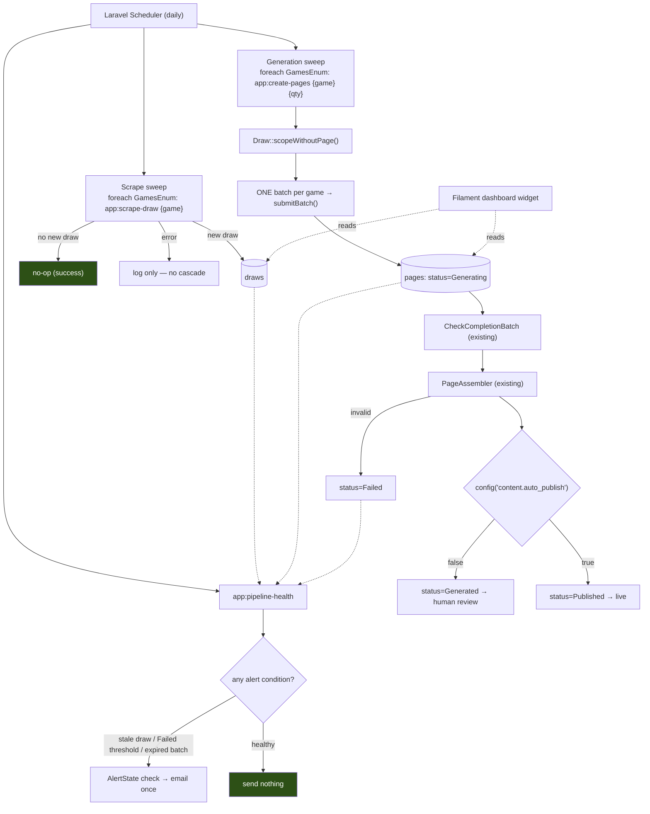

# Automation & Scheduling Design

**Spec**: `.specs/features/automation-and-scheduling/spec.md`
**Context**: `.specs/features/automation-and-scheduling/context.md`
**Source**: none — rebuilt from scratch; the 2026-07-11 source doc was rejected as ungrounded (defect table in `context.md`)
**Depends on**: `seo-draw-page-generation` (hard)
**Status**: Approved architecture

---

## Architecture Overview

Two scheduled sweeps and one scheduled health check. That is the whole system.

The design's defining property is **decoupling**: the scrape sweep and the generation sweep never talk to each other. Generation does not care why a draw lacks a page — only that it does. This single choice removes an entire category of machinery the source doc built (per-draw jobs, retry policies with jitter, dead-letter tables, checksums, circuit breakers), because **the next run is the retry**. A scrape that fails on Tuesday needs no backoff schedule; Wednesday's sweep scrapes it, and Wednesday's generation sweep picks it up because `scopeWithoutPage()` still returns it.



The dashed lines matter: the health check and the widget only ever **read** the tables the pipeline writes. They are observers, not participants — no heartbeat rows, no status tables, no state the pipeline must remember to update.

---

## Code Reuse Analysis

### Existing Components to Leverage

| Component | Location | How to Use |
| --------- | -------- | ---------- |
| `app:scrape-draw {game}` | `app/Console/Commands/ScrapeDraw.php` | **Unchanged.** Already infers "latest known + 1" when the draw number is omitted — which is exactly the sweep's semantics. The sweep calls it once per game with no draw number |
| `app:create-pages {game} {quantity}` | `app/Console/Commands/CreatePages.php` (rewired by seo) | **Unchanged signature.** The sweep calls it per game; the command already selects via `scopeWithoutPage()` and submits one batch |
| `Draw::scopeWithoutPage()` | `app/Models/Draw.php:31` | The **sole** dedup mechanism (AUTO-07). Not supplemented, not replaced |
| `GamesEnum` | `app/Enums/GamesEnum.php` | Both sweeps and the health check iterate `GamesEnum::cases()` — never a hardcoded game list. This is what makes `additional-lotteries` a zero-touch change here (AUTO-20) |
| `CheckCompletionBatch` | `app/Jobs/CheckCompletionBatch.php` (rewired by seo) | **Unchanged.** Already self-re-dispatches on `in_progress` and marks pages `Failed` on `expired`/`cancelled` (DRAWPAGE-08). This feature only adds an *email* on that existing branch |
| `PageStatus` enum + `PageAssembler` | created by seo | Read by the health check and widget; not modified |
| `config('content.auto_publish')` | `config/content.php` (created by seo) | Consumed, not built (AD-006) |
| Laravel Scheduler (`routes/console.php`) | framework | **Currently empty of schedules** — verified. This feature is its first user |
| Laravel `failed_jobs` table | framework default | The dead-letter queue. No custom table is added (AD-009) |
| Laravel Mail (`config/mail.php`) | framework | Backs the alert email. Already configured; no new transport |
| Filament widget scaffolding | `php artisan make:filament-widget` | Backs the dashboard widget |

### Integration Points

| System | Integration Method |
| ------ | ------------------ |
| `routes/console.php` | Where all three scheduled entries are registered. Currently has no schedule entries — this feature introduces them |
| Filament admin (`/admin`) | One new dashboard widget, auto-discovered by `AdminPanelProvider` |
| Queue | Uses whatever worker exists. This feature does **not** create named queues or set concurrency caps (AD-009) |

---

## Components

### Scheduled entries (`routes/console.php`)

- **Purpose**: The entire scheduling surface — three entries, no scheduler classes, no cron abstraction.
- **Location**: `routes/console.php`
- **Interfaces**:
  ```php
  // Scrape sweep — one per game, daily, after the latest plausible draw time.
  foreach (GamesEnum::cases() as $game) {
      Schedule::command('app:scrape-draw', [$game->value])
          ->dailyAt(config('content.schedule.scrape_at'))
          ->withoutOverlapping();
  }

  // Generation sweep — decoupled from scraping by design (see context.md).
  foreach (GamesEnum::cases() as $game) {
      Schedule::command('app:create-pages', [$game->value, config('content.schedule.batch_size')])
          ->dailyAt(config('content.schedule.generate_at'))
          ->withoutOverlapping();
  }

  Schedule::command('app:pipeline-health')->dailyAt(config('content.schedule.health_at'));
  ```
- **Dependencies**: `GamesEnum`, `config('content.schedule')`
- **Reuses**: both commands entirely as-is
- **Covers**: AUTO-01, AUTO-04, AUTO-18, AUTO-20

`withoutOverlapping()` on both sweeps is what satisfies AUTO-18 — a slow Caixa response cannot cause a second sweep to double-scrape or double-batch.

### `App\Console\Commands\PipelineHealth`

- **Purpose**: The only new command. Reads the pipeline's own tables, decides whether anything is wrong, and emails at most once per ongoing condition.
- **Location**: `app/Console/Commands/PipelineHealth.php`
- **Interfaces**: `app:pipeline-health` (no arguments)
- **Checks performed**:
  1. **Stale draw** — for each `GamesEnum` case, the most recent `Draw`'s date is older than `config('content.alerts.max_draw_gap_days')` (AUTO-08)
  2. **Failed backlog** — `Page::where('status', PageStatus::Failed)->count()` exceeds `config('content.alerts.failed_page_threshold')` (AUTO-09)
- **Dependencies**: `Draw`, `Page`, `PageStatus`, `AlertNotifier`
- **Reuses**: nothing new — it is a pure read over existing tables
- **Note**: the *expired-batch* alert (AUTO-10) does **not** live here. It fires from `CheckCompletionBatch`'s existing `expired`/`cancelled` branch, at the moment the condition is detected — that branch already exists (DRAWPAGE-08) and already marks pages `Failed`; it gains one `AlertNotifier` call.
- **Covers**: AUTO-08, AUTO-09, AUTO-14

### `App\Services\AlertNotifier`

- **Purpose**: The single place an alert email is sent, and the single place the "have I already said this?" question is answered. Isolating both means AUTO-11 (de-dup) and AUTO-12 (mail failure is non-fatal) are enforced once, not at each call site.
- **Location**: `app/Services/AlertNotifier.php`
- **Interfaces**:
  - `notify(string $key, string $subject, array $context): void`
- **Behavior**:
  - The `$key` identifies the *condition*, not the occurrence — e.g. `stale-draw:megasena`, `failed-backlog`, `expired-batch:{batch_id}`.
  - If `$key` is already in the alert-state store and unresolved, **send nothing** (AUTO-11).
  - Otherwise send, then record `$key` with a timestamp.
  - A condition absent from the current check's findings is **cleared** from the store, so the same condition can alert again if it recurs later. (Without this, an alert fires once for the lifetime of the app — a subtle way to build a system that goes quiet exactly when it shouldn't.)
  - The entire send is wrapped: a `Throwable` from the mailer is **logged and swallowed** (AUTO-12).
- **Dependencies**: Laravel Mail, cache or a small `alert_states` table (decided at Tasks time — see Data Models)
- **Reuses**: `config('mail.*')` as already configured
- **Covers**: AUTO-10, AUTO-11, AUTO-12

### `App\Filament\Widgets\PipelineStatusWidget`

- **Purpose**: At-a-glance pipeline state on the Filament dashboard.
- **Location**: `app/Filament/Widgets/PipelineStatusWidget.php`
- **Interfaces**: displays `Page` counts grouped by `PageStatus`, and the most recent `Draw` date per `GamesEnum` case
- **Dependencies**: `Page`, `PageStatus`, `Draw`, `GamesEnum`
- **Reuses**: Filament's stats-widget scaffolding; auto-discovered by `AdminPanelProvider`
- **Covers**: AUTO-13

### `App\Jobs\CheckCompletionBatch` (existing, one-line addition)

- **Purpose**: Unchanged polling behavior; gains the operator signal on batch-level failure.
- **Location**: `app/Jobs/CheckCompletionBatch.php`
- **Change**: the `expired`/`cancelled` branch — which seo already gives a mark-pages-`Failed` behavior — additionally calls `AlertNotifier::notify("expired-batch:{$batchId}", ...)`.
- **Covers**: AUTO-10

---

## Data Models

**No changes to `draws` or `pages`.** This is a deliberate and load-bearing property: the health check and widget are pure readers. Nothing in the pipeline has to remember to update a status table, which means no code path can forget to.

The one piece of new state is **alert de-duplication** (AUTO-11) — remembering "I already emailed about this". Two viable substrates, decided at Tasks time:

| Option | Pros | Cons |
| ------ | ---- | ---- |
| **Cache** (`Cache::put($key, now(), $ttl)`) | Zero migration; TTL gives natural re-alerting after N days | Lost on cache flush → a duplicate email. Harmless |
| **`alert_states` table** (`key`, `first_seen_at`, `last_notified_at`) | Survives cache flush; auditable history of past alerts | A migration and a model for a genuinely trivial concern |

**Recommendation: cache.** A duplicate alert email after a cache flush is a non-event; a migration to prevent it is exactly the kind of machinery the ops-posture decision (AD-009) exists to refuse. Recorded here so the Tasks phase makes the choice consciously rather than by default.

`config/content.php` gains:

```php
'schedule' => [
    'scrape_at'   => env('SCHEDULE_SCRAPE_AT', '23:30'),   // after latest plausible draw time
    'generate_at' => env('SCHEDULE_GENERATE_AT', '01:00'), // decoupled — not chained to scrape
    'health_at'   => env('SCHEDULE_HEALTH_AT', '09:00'),   // morning, so alerts land before the workday
    'batch_size'  => env('SCHEDULE_BATCH_SIZE', 25),
],

'alerts' => [
    'mail_to'                 => env('ALERT_MAIL_TO'),
    'max_draw_gap_days'       => env('ALERT_MAX_DRAW_GAP_DAYS', 5),
    'failed_page_threshold'   => env('ALERT_FAILED_PAGE_THRESHOLD', 5),
],
```

Times are defaults, not commitments — tunable per the spec's Assumptions table.

---

## Error Handling Strategy

| Error Scenario | Handling | User Impact |
| -------------- | -------- | ----------- |
| Scheduled scrape fails for one game | Logged; other games' scrapes unaffected; generation sweep still runs (AUTO-03) | Nothing else breaks. Tomorrow's sweep retries implicitly |
| Scheduled scrape finds no new draw | **Success**, not failure (AUTO-02) | No alert. This is the normal case on non-draw days and is not an anomaly |
| Every game's scrape fails (Caixa down) | Each logged independently; no immediate alert | The stale-draw check alerts only once the gap exceeds `max_draw_gap_days`, so a single bad day is correctly silent |
| Generation sweep runs with nothing to generate | Success, no-op (AUTO-05) | No alert |
| A batch expires or is cancelled | Pages → `Failed` (existing, DRAWPAGE-08) **+** one email (AUTO-10) | Operator learns immediately rather than finding pages stuck |
| Pages pile up at `Failed` | Health check emails once past the threshold (AUTO-09) | A systematically broken prompt surfaces before it consumes a month of batches |
| The alert mailer itself fails | Logged; health check exits **0** (AUTO-12) | A broken mailer does not become a second failing pipeline generating more unsendable alerts |
| Two sweeps overlap | `withoutOverlapping()` skips the second (AUTO-18) | No double-scrape, no double-batch |
| A batch is still `in_progress` when the next generation sweep fires | Its draws already have `Page` rows at `Generating`, so `scopeWithoutPage()` excludes them (AUTO-19) | No duplicate batch for the same draws. **This is dedup falling out of the existing scope for free** — no new guard was needed |

---

## Risks & Concerns

| Concern | Impact | Mitigation |
| ------- | ------ | ---------- |
| **This design assumes a scheduler and queue worker actually run** in the deploy target. `routes/console.php` currently registers no schedules, and nothing in the repo provisions `schedule:run` or `queue:work` | Every scheduled entry here is inert until infrastructure exists. Automation could be "done" and produce nothing | Explicit dependency on `infrastructure-cloud-postgres-backups`, declared in the spec's Out of Scope and Assumptions. **These two features must ship together to deliver operator value**, even though they are independently testable. Flagged for sequencing at Tasks time |
| Alert de-dup that never clears | If a condition is recorded and never cleared, the system alerts once and then goes permanently silent about a real, ongoing problem — the exact failure mode alerting exists to prevent | `AlertNotifier` **clears** keys absent from the current findings, so a recurring condition re-alerts. Called out explicitly in the component spec because this is a classic, quiet bug |
| Draw-day ignorance means the stale-gap threshold is a blunt instrument | A game that draws twice weekly and one that draws six times weekly share a crude "days since last draw" check; the threshold must be loose enough for the slowest game, making it slow to catch a fast game's outage | Accepted, consciously. `max_draw_gap_days` is **per-game configurable**, which recovers most of the precision without reintroducing a draw calendar. The alternative (a draw-schedule table) was explicitly rejected in discuss |
| `withoutOverlapping()` uses a lock with a default expiry; a hard-crashed run can hold a stale lock | A sweep could be skipped for up to the lock TTL | Set an explicit, short expiry on the sweeps. Low severity: a skipped sweep self-heals on the next run — the same property that makes this whole design cheap |
| A single email address (`ALERT_MAIL_TO`) is a single point of failure for observability | If that inbox filters the mail, the pipeline is silently unobserved again | The Filament widget (AUTO-13) is the deliberate second surface — the reason "email **+** widget" was chosen over either alone |
| `config('content.auto_publish') = true` + an unnoticed prompt regression | Bad pages go live automatically | Out of this feature's control by design, but bounded: AUTO-17 guarantees validation still gates publishing, so a *malformed* page can never go live — only a *valid but poor* one. That is a prompt-quality problem, not an automation problem |

> All flagged concerns have a mitigation — no unmitigated risk remains open.

---

## Tech Decisions (only non-obvious ones)

| Decision | Choice | Rationale |
| -------- | ------ | --------- |
| Scrape and generation are **not** chained | Two independent scheduled sweeps; generation reads `scopeWithoutPage()` | This is the keystone. It makes the system self-healing (next run = retry), preserves one-batch-per-game economics, and deletes the need for retry policies, backoff, jitter, dead-letter tables, and checksums — all of which the rejected source doc specified. **The absence of that machinery is the design, not an omission from it** |
| No draw-schedule table | Daily sweep, schedule-agnostic | A cadence table is a maintenance liability that must be corrected whenever Caixa changes a draw day, in exchange for freshness that has no SEO value for these queries. Also avoids asserting Brazilian lottery draw days from memory |
| Health check **reads** existing tables; the pipeline records no health state | Observer, not participant | Any "pipeline updates its own status" scheme has a failure mode where the pipeline dies *before* recording that it died. Deriving health from `draws`/`pages` timestamps cannot lie |
| Expired-batch alert fires from `CheckCompletionBatch`, not the health check | At detection, not on the next daily poll | The condition is already detected there (DRAWPAGE-08). Re-detecting it in a daily sweep would duplicate logic and delay the signal by up to 24h |
| Alert de-dup keyed by *condition*, not occurrence | `stale-draw:megasena`, not `stale-draw:2026-07-13` | An occurrence key re-alerts every single day for one ongoing problem — which trains the operator to ignore the alerts, which is worse than no alerts |
| Sweeps iterate `GamesEnum::cases()` | Never a hardcoded game list | Makes `additional-lotteries` a zero-touch change to this feature (AUTO-20) |
| No named queues, concurrency caps, or circuit breakers | Rejected outright | Volume is a handful of pages per week. Every one of these is a moving part that can break, monitoring a system that cannot meaningfully be overloaded (AD-009) |

> **Project-level decisions**: the decoupled-sweep topology is recorded as `AD-007`, and the minimal ops posture as `AD-009`, in `.specs/STATE.md`.
