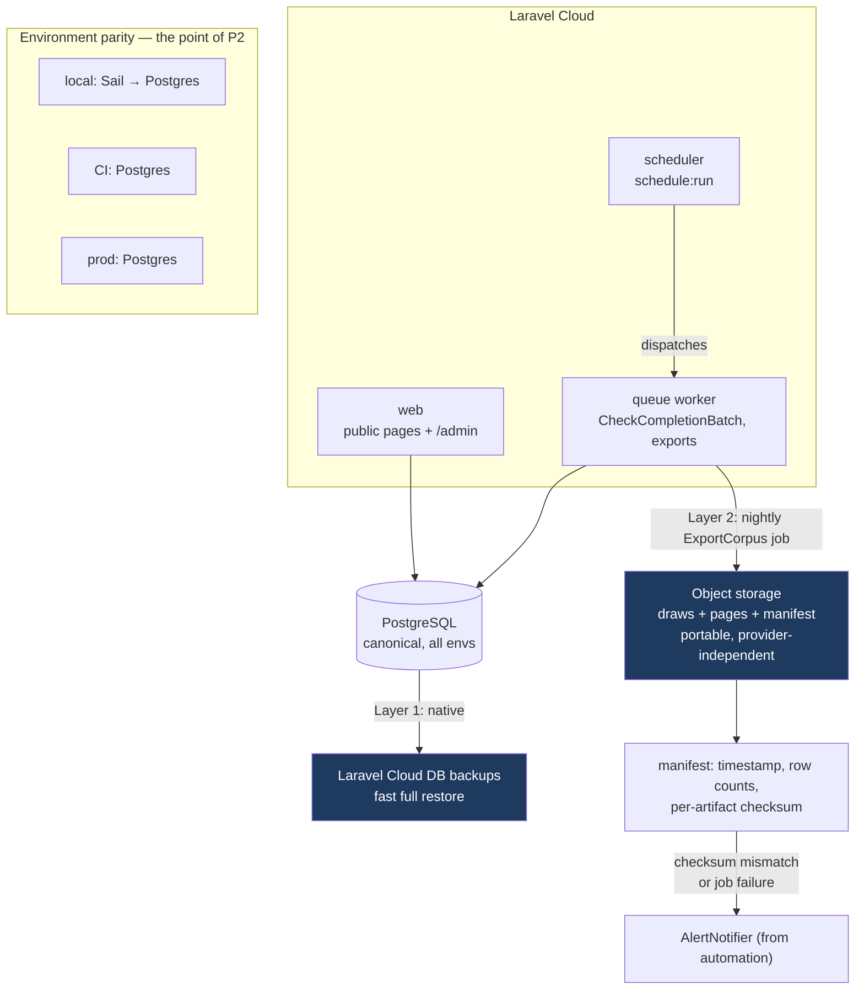

# Infrastructure: Laravel Cloud, Postgres, Backups Design

**Spec**: `.specs/features/infrastructure-cloud-postgres-backups/spec.md`
**Source**: `docs/superpowers/specs/2026-07-11-infrastructure-cloud-postgres-backups-design.md`
**Depends on**: `seo-draw-page-generation` (soft — only the `pages` backup target)
**Blocks**: `automation-and-scheduling`
**Status**: Implemented — dialect audit complete (`dialect-audit.md`), code-only scope done (see `tasks.md`/`STATE.md`); operator-gated production tasks (T11/T19/T20/T21) remain open

---

## Architecture Overview

Three processes, one database engine, two backup layers.

The shape is deliberately boring. The only genuinely interesting decision is the **dual-layer backup**: Laravel Cloud's native DB backups are the fast path for "the database broke," and a nightly portable export to object storage is the slow path for "the provider account is gone." The generated page corpus is the one asset in this project that cannot be recreated — draws re-scrape from Caixa for free, but pages cost real LLM spend and would never regenerate identically — so it gets two independent mechanisms with different failure domains.



Layer 1 and Layer 2 fail for different reasons. That is the entire design rationale — two backups that share a failure domain are one backup.

---

## Code Reuse Analysis

### Existing Components to Leverage

| Component | Location | How to Use |
| --------- | -------- | ---------- |
| `config/database.php` | existing | Postgres connection promoted to the default; SQLite and MySQL connections removed rather than left as tempting fallbacks |
| `docker-compose.yml` (Sail) | existing | MySQL service replaced with Postgres. **Same major version as Laravel Cloud provisions** — parity is the requirement, not a specific number |
| `phpunit.xml` | existing | Test DB env vars repointed from SQLite to Postgres |
| Laravel `failed_jobs` table | framework default | The dead-letter queue for the worker (INFRA-02). No custom table (AD-009) |
| `App\Services\AlertNotifier` | created by `automation-and-scheduling` | **Reused** for export-failure alerts (INFRA-13, INFRA-14) — including its de-dup behavior, so a backup broken for a week emails once, not seven times |
| Laravel filesystem (`config/filesystems.php`) | existing | Object-storage disk for export artifacts. Already scaffolded; needs a configured disk |
| Laravel Scheduler | `routes/console.php` | The nightly export registers here alongside automation's sweeps |
| `Draw`, `Page` models | existing / created by seo | Export sources. Read-only — the export never mutates them |

### Integration Points

| System | Integration Method |
| ------ | ------------------ |
| `automation-and-scheduling` | **Bidirectional.** This feature provides the scheduler/worker that automation's entries need; automation provides the `AlertNotifier` that this feature's export failures use. They interlock — see Risks |
| Laravel Cloud | Deploy config declares three process types; deploy pipeline runs `migrate --force` |
| CI | Postgres service container; suite runs against it |

---

## Components

### Laravel Cloud process definitions

- **Purpose**: The three process types that make everything else run.
- **Location**: Laravel Cloud deploy configuration (not a repo file, except for any committed config the platform reads)
- **Interfaces**:
  - **web** — serves public pages and `/admin`. Cold starts accepted.
  - **worker** — `queue:work`. Consumes `CheckCompletionBatch` and the nightly export job. Cold starts accepted.
  - **scheduler** — `schedule:run` every minute. **Kept warm**: a scheduler that cold-starts is a scheduler that misses its window, which silently defeats every scheduled task in `automation-and-scheduling`.
- **Covers**: INFRA-01, INFRA-02, INFRA-03, INFRA-05

The asymmetry is deliberate: cost-first everywhere *except* the scheduler, because a missed scheduler tick has no retry and produces no error — it just quietly does nothing.

### Postgres standardization

- **Purpose**: One engine, every environment.
- **Location**: `config/database.php`, `docker-compose.yml`, `phpunit.xml`, CI workflow
- **Interfaces**: Postgres as the default connection in all four
- **Key work**:
  - **Dialect audit** (INFRA-10) — grep for raw `DB::` usage, `whereJsonContains`, `whereJsonPath`, `whereRaw`, and any engine-specific column type in migrations. Project convention is Eloquent-only (per `CLAUDE.md`), so the expected finding is "little to nothing" — but that must be *confirmed*, not assumed.
  - **JSON round-trip verification** (INFRA-09) — `draws.raw_data` and `pages.blocks` are the two JSON columns. Every `Draw` accessor reads out of `raw_data` **in PHP**, not SQL, which is what makes this migration low-risk; the verification exists to prove that rather than trust it.
- **Covers**: INFRA-06, INFRA-07, INFRA-08, INFRA-09, INFRA-10

### Production cutover

- **Purpose**: Move existing data to Postgres.
- **Scope note**: **Only `draws` moves.** Per AD-003, `draw_pages` rows are discarded and pages are regenerated from scratch — so at cutover time the expensive corpus does not yet exist. This makes the cutover dramatically cheaper than the source design assumed, and it means the cutover should happen **before** the corpus is built, not after.
- **Sequence**:
  1. Snapshot the source DB; keep the snapshot immutable.
  2. Provision Postgres; run migrations.
  3. Backfill `draws`.
  4. Validate: row-count parity **and** deep comparison of a random sample of `raw_data` payloads (INFRA-11). Row counts alone would not catch a JSON serialization corruption, which is precisely the failure this migration risks.
  5. Switch connection config; run public + admin read-path smoke checks.
  6. On failure → revert connection config, redeploy previous known-good config (INFRA-20).
- **Covers**: INFRA-11, INFRA-20

### `App\Jobs\ExportCorpus`

- **Purpose**: Layer 2. The portable, provider-independent backup.
- **Location**: `app/Jobs/ExportCorpus.php`
- **Interfaces**: queued job, scheduled nightly
- **Behavior**:
  - Exports `draws` and `pages` to object storage in a portable format (JSON/NDJSON or CSV — decided at Tasks time; the requirement is that restoring it must not require Laravel Cloud, Postgres-specific dump tooling, or this application's code).
  - Writes a **manifest**: export timestamp, row count per table, per-artifact checksum, schema/app version.
  - Re-reads the written artifact and validates its checksum against the manifest. A backup that was never verified as readable is a rumor, not a backup.
  - On checksum mismatch **or** any failure → `AlertNotifier::notify('export-failed', ...)` (INFRA-13, INFRA-14).
  - If the `pages` table does not exist yet (seo hasn't shipped), exports `draws` alone and succeeds (INFRA-18).
  - An empty `pages` table produces a valid, well-formed, zero-row artifact — not a skipped file (INFRA-19).
- **Dependencies**: `Draw`, `Page`, filesystem disk, `AlertNotifier`
- **Covers**: INFRA-12, INFRA-13, INFRA-14, INFRA-18, INFRA-19

### Restore procedure + the one real drill

- **Purpose**: Prove the backup is restorable.
- **Location**: a runbook in `docs/`, plus an artisan command if the Tasks phase finds one warranted
- **Interfaces**: restore from an export artifact into an empty database; verify row counts; render a sample of previously-`Published` pages
- **The non-negotiable part**: this is **executed for real, once, against a scratch database**, and the elapsed time recorded (INFRA-16). An untested restore procedure has a roughly even chance of not working, and the moment you find out is the worst possible moment.
- **Deliberately dropped from the source design**: *quarterly* restore drills. A recurring calendar obligation for a solo operator will not be honored, and a process that is documented but not performed is worse than an honest one-time proof, because it manufactures confidence. One real drill, done, beats four scheduled and skipped.
- **Covers**: INFRA-15, INFRA-16

### Retention

- Daily artifacts: 35 days. Monthly: 12 months (INFRA-17).
- Enforced by object-storage lifecycle rules, not application code — a lifecycle policy cannot forget to run.

---

## Data Models

**No application schema changes.** This feature moves data between engines and copies it out; it does not reshape it.

Export artifact layout:

```
s3://{bucket}/exports/{YYYY-MM-DD}/
    draws.ndjson          # full table, one row per line
    pages.ndjson          # full table, one row per line (absent pre-seo; empty-but-valid if no rows)
    manifest.json         # timestamp, per-table row counts, per-artifact sha256, app/schema version
```

NDJSON is the leading candidate precisely because it is restorable with `jq` and a shell loop if every other tool in the stack is unavailable — which is the scenario Layer 2 exists for.

---

## Error Handling Strategy

| Error Scenario | Handling | User Impact |
| -------------- | -------- | ----------- |
| Export job fails (storage unreachable, permissions, OOM) | Job fails loudly → `failed_jobs` → `AlertNotifier` email (INFRA-14) | Operator learns the backup is broken while it is still cheap to fix |
| Export writes an artifact whose checksum does not match the manifest | Treated as a **failed** export; alerts (INFRA-13) | A silently corrupt backup — the most dangerous failure in this feature — cannot survive undetected |
| `pages` table does not exist (pre-seo deploy) | Export `draws` only; succeed (INFRA-18) | This feature deploys independently of its soft dependency |
| `pages` exists but is empty | Valid zero-row artifact with a truthful count (INFRA-19) | An empty backup is distinguishable from a missing one |
| Cutover validation fails (row mismatch or `raw_data` corruption) | Revert connection config; redeploy previous known-good; snapshot stays immutable (INFRA-20) | Cutover is reversible |
| Cold start on a web request | Request succeeds, slowly | Accepted trade. A cold start that *errors* is a defect, not a trade-off |
| Scheduler misses a tick | No automatic retry exists — this is why the scheduler is kept warm | Mitigated by design (warm scheduler), and by automation's self-healing daily sweeps: a missed day is corrected the next day |
| Migration fails mid-deploy | Deploy fails; previous version stays live | Standard Laravel Cloud deploy semantics |

---

## Risks & Concerns

| Concern | Impact | Mitigation |
| ------- | ------ | ---------- |
| **Circular dependency with `automation-and-scheduling`**: this feature needs `AlertNotifier` (built there), and that feature needs the scheduler/worker (built here) | Neither can be fully completed before the other, which will deadlock a naive task ordering | **Break the cycle at the seam**: `AlertNotifier` is a small, self-contained service with no infrastructure dependency. Build it **first**, as a shared prerequisite of both features. Whichever feature is executed first carries it. This must be an explicit ordering decision at Tasks time, not discovered mid-execution |
| Engine-specific SQL may exist and has **not** been audited | A dialect bug would surface after cutover, in production, against real data | Dialect audit is a **blocking task** (INFRA-10) before cutover. Expected finding is near-zero given the Eloquent-only convention — but "expected" is not "verified", and this is exactly the assumption that, if wrong, is wrong expensively |
| JSON column semantics differ across engines | `raw_data` and `blocks` are the project's core data. A silent serialization change would corrupt every `Draw` accessor at once | INFRA-09 round-trips real payloads and asserts accessor-level equality — not just that the column "looks like JSON". Cutover validation deep-compares sampled `raw_data` (INFRA-11), because row counts cannot detect corrupted contents |
| The one-time restore drill could be skipped under delivery pressure | An unverified restore path is indistinguishable from no backup, while feeling like a backup | INFRA-16 is a **P3 acceptance criterion with an artifact** (a recorded elapsed time), not a documentation task. It is not satisfiable by writing a runbook — only by executing one |
| Cost-first cold starts applied to the **scheduler** | A cold-starting scheduler misses ticks silently — no error, no retry, no signal. Every scheduled task in the project would degrade invisibly | Scheduler is explicitly exempted from the cost-first posture and kept warm. Called out here because it is the one place the stated constraint must be violated on purpose |
| Retiring SQLite/MySQL removes the local fallback | A developer with a broken Docker setup cannot trivially run the app | Accepted, and it is the point (AD-008). A local engine that differs from production is precisely the bug factory this feature exists to close. Convenience here buys production risk |
| Cutover timing vs. corpus | If cutover happens *after* a large page corpus is generated, the migration becomes expensive and risky | **Sequence this feature's cutover before the corpus is built.** Per AD-003, only `draws` exists to migrate today — that window is open now and closes as soon as generation runs at scale. Flagged for cross-feature sequencing |

> All flagged concerns have a mitigation — no unmitigated risk remains open.

---

## Tech Decisions (only non-obvious ones)

| Decision | Choice | Rationale |
| -------- | ------ | --------- |
| Dual-layer backup rather than one good one | Native provider backups **+** portable object-storage export | Two mechanisms with the **same failure domain** are one mechanism. Native backups die with the provider account; a portable export in a different bucket does not. The page corpus is the only unreproducible asset the project has, and it justifies exactly this much paranoia and no more |
| Portable format (NDJSON), not `pg_dump` | Restorable without Postgres tooling or this app's code | A backup you can only restore with the exact stack you just lost is a bet, not insurance |
| Export **verifies its own artifact** by re-reading and checksumming | Not just "the write returned success" | An unread backup is a rumor. This is the cheapest possible protection against the feature's single most dangerous failure: a backup that silently isn't one |
| **One real restore drill**, not quarterly recurring drills | Source design's quarterly cadence deliberately dropped | A recurring obligation a solo operator will not honor produces documented-but-false confidence. One executed drill is strictly more truthful than four scheduled ones |
| Scheduler kept warm; web and worker cold-start freely | Deliberate exception to the cost-first posture | A missed scheduler tick is silent and unretried. This is the one place saving money buys invisible failure |
| Postgres in local dev too — SQLite/MySQL fully retired | No fallback engine left available | Parity is worthless if it is optional. Leaving SQLite configured guarantees someone runs the suite against it and ships a dialect bug |
| Cutover moves `draws` only | Pages are regenerated, not migrated | Falls out of AD-003. Recognizing this collapses the migration from "move the irreplaceable corpus" to "move a table that could be re-scraped anyway" |

> **Project-level decision**: PostgreSQL as the canonical engine across all environments is recorded as `AD-008` in `.specs/STATE.md`.
