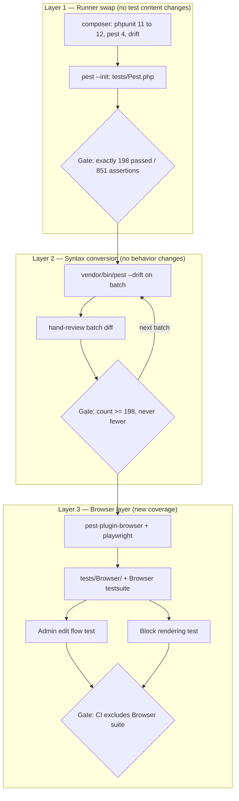

# Pest Migration & Browser Tests Design

**Spec**: `.specs/features/pest-migration-browser-tests/spec.md`
**Status**: Draft

---

## Architecture Overview

Three sequential layers. Each is independently verifiable, and each must be green before the next begins — this is the whole point of the ordering, because it makes any failure attributable to exactly one cause.

**Why this order is load-bearing:** the PHPUnit 11→12 bump and the syntax conversion are two independent sources of breakage over the same 198 tests. Running them together makes a red suite ambiguous. Layer 1's gate asserts the *exact* baseline (198/851, not "≥") precisely because a runner swap that changes the count means something was silently skipped, not fixed.

---

## Code Reuse Analysis

### Existing Components to Leverage

| Component | Location | How to Use |
| --------- | -------- | ---------- |
| `Tests\TestCase::ensureViteManifest()` | `tests/TestCase.php:16` | Move into `tests/Pest.php` as a `beforeEach` hook. A real browser *actually fetches* these assets, so this stops being a convenience and becomes load-bearing. |
| `PageFactory` | `database/factories/PageFactory.php` | `->published()` state gives the `PageStatus::Published` a public route requires (AD-006). Already exists — do not write a new fixture path. |
| `DrawFactory::fixture()` | `database/factories/DrawFactory.php` | Used by `PageResourceTest` as `->fixture(GamesEnum::MEGA_SENA->value, 2608)`. Reuse for browser fixtures — real payload shape, not invented data. |
| `UserFactory` | `database/factories/UserFactory.php` | Seeds the admin user for the real `/admin/login` form. |
| `PageResourceTest` | `tests/Feature/Filament/PageResourceTest.php` | Reference for how the Filament editor is currently driven (Livewire-level). The browser test asserts the same surface one layer up, through real HTTP. |
| Existing `phpunit.xml` `<php>` env block | `phpunit.xml` | Keep verbatim; add a `Browser` testsuite alongside `Unit`/`Feature`. |

### Integration Points

| System | Integration Method |
| ------ | ------------------ |
| Postgres (port **5433**) | Inherited from `.env` via `phpunit.xml`'s `DB_DATABASE=testing`. **Never hardcode 5432** — that port belongs to an unrelated project on this machine. Conforms to AD-008. |
| Filament admin panel | Real HTTP through `/admin/login` (panel has `->login()` enabled). |
| Public draw route | `routes/web.php` `/{game}/resultado/{concurso}`, filtered to `PageStatus::Published`. |
| Playwright | Node 24 present locally. `npm install playwright@latest && npx playwright install`. |

---

## Components

### Pest bootstrap

- **Purpose**: Bind Laravel's `TestCase` and `RefreshDatabase` per directory, and carry over the Vite-manifest stub.
- **Location**: `tests/Pest.php` (new)
- **Interfaces**:
  - `pest()->extend(Tests\TestCase::class)->use(RefreshDatabase::class)->in('Feature', 'Browser')`
  - `pest()->extend(Tests\TestCase::class)->in('Unit')` — Unit tests must **not** get `RefreshDatabase`; several are pure (`NulSafeJsonTest`, `BlockRegistrationTest`) and adding a transaction to them would be a silent slowdown and a behavior change.
  - `beforeEach(fn () => $this->ensureViteManifest())`
- **Dependencies**: Pest 4, `Tests\TestCase`
- **Reuses**: `Tests\TestCase::ensureViteManifest()`

### Testsuite topology

- **Purpose**: Keep the browser suite out of the default fast path and out of CI (PEST-13, PEST-15).
- **Location**: `phpunit.xml`
- **Interfaces**: adds `<testsuite name="Browser"><directory>tests/Browser</directory></testsuite>`
- **Note**: `php artisan test` with no argument runs **all** testsuites, so PEST-13's "runs without Playwright" is satisfied by `--testsuite=Unit,Feature`, which is what CI will call explicitly. Bare `php artisan test` remains the "run everything including browser" command locally.

### Browser fixture builder

- **Purpose**: Produce one `Draw` + one `Published` `Page` carrying blocks with **distinctive, assertable** text, so a missing block is a named failure (PEST-08 AC2).
- **Location**: `tests/Browser/Fixtures/DrawPageFixture.php` (new) — a plain helper, not a factory state, because it composes two models plus a block payload.
- **Interfaces**:
  - `make(): array{draw: Draw, page: Page, markers: array<string,string>}` — `markers` maps block type → the unique string that must appear on the rendered page.
- **Dependencies**: `DrawFactory::fixture()`, `PageFactory::published()`
- **Reuses**: both existing factories; no new migration, no new model.

### Browser tests

- **Purpose**: The two flows the feature exists for.
- **Location**: `tests/Browser/AdminEditsPageTest.php`, `tests/Browser/DrawPageRendersBlocksTest.php` (new)
- **Interfaces** (from verified Pest 4 browser API):
  - `visit('/admin/pages')->assertPathIs('/admin/login')` — PEST-10
  - `->type('email', ...)->type('password', ...)->press('Sign in')` — PEST-10 AC2
  - `->assertSee($originalTitle)` — PEST-05
  - `->fill('...title', $newTitle)->press('Save changes')->assertSee('Saved')` — PEST-06
  - `visit($publicUrl)->assertSee($newTitle)->assertDontSee($originalTitle)` — PEST-07
  - `->assertNoJavaScriptErrors()` — PEST-11
- **Dependencies**: `pest-plugin-browser`, Playwright browsers, Postgres
- **Failure artifacts**: none required in test code — Pest writes a screenshot of the failing page automatically to `tests/Browser/Screenshots/`, named after the failing test. `tests/Browser/Screenshots` **must be added to `.gitignore`** (per Pest's own getting-started guidance) so debugging artifacts are never committed.

---

## Blocks Covered by PEST-08

Measured from `resources/views/components/filament-fabricator/page-blocks/`, not assumed.

**Implemented (in scope — each must render its marker):** `hero-section`, `results-grid`, `individual-draw-details`, `faq`, `related-links`, `rich-text-content`, `statistics-cards`, `latest-results`, `number-generator`, `how-to-play`.

**Unimplemented stubs (excluded, with reason):** `breadcrumb`, `comparison-table`, `simulation`, `timeline` — all four are 114-byte templates rendering a literal `//` placeholder and no content. Asserting they render text would be asserting a falsehood. Recorded as follow-up **PEST-F3**, not silently dropped (lesson L-006).

---

## Error Handling Strategy

| Error Scenario | Handling | Impact |
| -------------- | -------- | ------ |
| Playwright browsers not installed | Browser suite fails; `--testsuite=Unit,Feature` unaffected. Install command documented in `CLAUDE.md`. | PEST-13 |
| PHPUnit 12 breaks an existing test | Layer 1 gate catches it before any conversion begins; cause is unambiguous. | PEST-02 |
| Drift mangles a file | Per-batch parity gate (count never < 198) + hand review of each batch diff. | PEST-03 |
| Filament save is async (Livewire) | Assert on the save confirmation, not immediately after `press()`. Pest's assertions auto-wait. | Edge case |
| Page seeded non-`Published` | Public route 404s. Test asserts 200/content explicitly rather than on an error body. | Edge case |
| Draw-page renders unstyled | **Expected true positive** — see Risks. Test asserts content, not styling, so it should still pass. | PEST-F2 |
| Browser test fails | Pest **automatically** writes a screenshot of the failing page state to `tests/Browser/Screenshots/`, named after the failing test. No explicit `screenshot()` call is required in the tests. | PEST-12 |

---

## Risks & Concerns

| Concern | Location | Impact | Mitigation |
| ------- | -------- | ------ | ---------- |
| **Test coverage gap**: no test crosses the HTTP boundary; AD-014 shipped a live SEO defect while 198 tests stayed green | whole suite | The exact class of bug this feature exists to catch | This feature. PEST-08/PEST-11 generalise the guard. |
| **Tech debt**: 4 page blocks are unimplemented `//` stubs but are registered and selectable in the admin | `page-blocks/{breadcrumb,comparison-table,simulation,timeline}.blade.php` | An editor can add a block that renders nothing, with no warning | Excluded from PEST-08 with reason; follow-up **PEST-F3**. |
| **Tech debt**: `draw-page.blade.php` never registers Fabricator styles (lesson L-011) | `layouts/draw-page.blade.php` | Public pages ship with no stylesheet; a real browser will render them unstyled | Out of scope by user decision → own spec, **PEST-F2**. Browser tests assert text content, not styling, so this should not produce a false red. |
| **Known upstream bug**: pest#1543 reports browser screenshots not being generated even with `--headed` | Pest browser plugin | PEST-12 could silently produce no artifact | Screenshot-on-failure is now **confirmed built-in** (below), so PEST-12 is satisfiable by default — but the open issue means it must be **verified empirically, not assumed**. Dedicated task deliberately fails a browser test and asserts a file appears in `tests/Browser/Screenshots`. |
| **Fragile**: `PageResourceTest` shares the Filament editor surface the browser test drives | `tests/Feature/Filament/PageResourceTest.php` | A Filament field-name change breaks both at once | Acceptable — two failures pointing at one cause is not ambiguity, it is corroboration. |
| **Risk**: local-only browser tests will rot | — | Untracked in CI, they silently stop being run (lesson L-004) | Recorded as **PEST-F1**; `CLAUDE.md` documents the command (PEST-14). |
| **Risk**: PHPUnit 12 + PHP 8.5 deprecation noise | INFRA-22 (112 `PDO::MYSQL_ATTR_SSL_CA` deprecations) | Existing noise may mask a genuine new failure at the Layer 1 gate | Gate on the exact **numeric** count (198/851), not on "looks green". |

---

## Tech Decisions

| Decision | Choice | Rationale |
| -------- | ------ | --------- |
| Conversion mechanism | `pest-plugin-drift` + hand review, in batches | User-confirmed. AST-based, mechanically consistent; batching + parity gate bounds the blast radius. |
| Runner bump isolation | Separate committed gate before any conversion | Two error sources over one suite makes a red result unattributable. |
| Parity gate strictness | Layer 1 = **exactly** 198/851; Layer 2 = **≥** 198 | A runner swap changing the count means silent skipping. Conversion may legitimately *add* (e.g. drift splitting a data provider into datasets). |
| Browser test DB | Postgres 5433, `RefreshDatabase` | Conforms to AD-008; Pest 4 confirmed to support `RefreshDatabase` in browser tests. Rejected SQLite-in-memory (Pest's own docs suggest it) as an AD-008 violation. |
| `RefreshDatabase` scope | `Feature` + `Browser` only, not `Unit` | Several Unit tests are pure; adding a DB transaction changes their behavior and cost. |
| Auth in the admin flow | Real `/admin/login` form, not `actingAs()` | PEST-10 requires the auth boundary itself be asserted. `actingAs` would bypass the thing under test. |
| CI invocation | `php artisan test --testsuite=Unit,Feature` | Bare `php artisan test` would run the Browser suite and fail on missing Playwright (PEST-15). |
| Failure artifacts | Rely on Pest's built-in auto-screenshot; gitignore the directory | Confirmed built-in, so no bespoke failure-hook code is warranted. Verified empirically rather than trusted, because pest#1543 reports it misbehaving. |

> **Project-level decision to record at Execute:** the runner standard changes from PHPUnit-class-based to Pest, and browser tests become the required guard for any change to a public-facing template. Append as **AD-016** to `.specs/STATE.md` (supersedes nothing; `CLAUDE.md`'s "PHPUnit, not Pest" claim is corrected by PEST-14).

---

## New Follow-Ups Raised by This Design

| ID | Item | Reason deferred |
| -- | ---- | --------------- |
| PEST-F1 | Run browser tests in CI | User: too slow for CI now |
| PEST-F2 | Fix `draw-page.blade.php` missing stylesheet (L-011) | User: gets its own spec |
| PEST-F3 | Implement or unregister the 4 stub page blocks | Discovered during design; unrelated to this diff |
