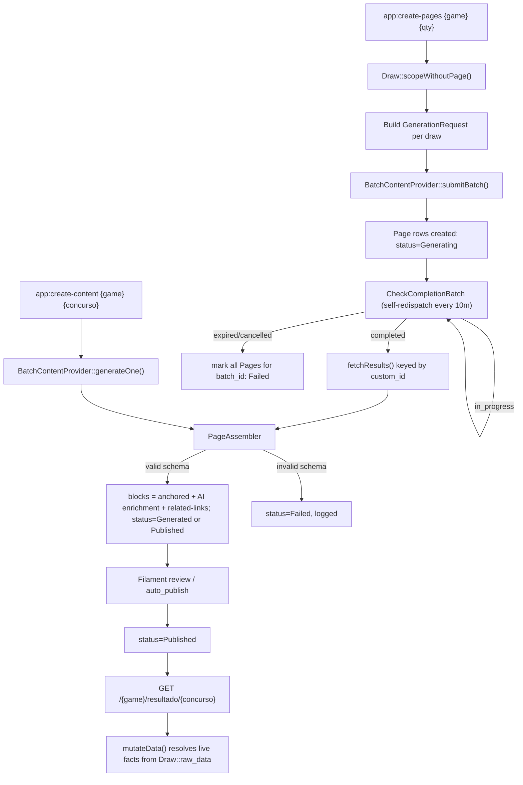

# SEO Draw-Page Generation Design

**Spec**: `.specs/features/seo-draw-page-generation/spec.md`
**Source**: `docs/superpowers/specs/2026-07-11-seo-draw-page-generation-design.md`
**Status**: Approved (carried over from the source design's approved status — architecture was not re-opened, only formalized into TLC structure and cross-checked against the current codebase)

---

## Architecture Overview

A draw page is a Fabricator `Page` row whose `blocks` array is assembled from two sources: a fixed spine of **anchored** blocks that always resolve their facts live from `Draw::raw_data`, and an AI-chosen, AI-ordered set of **enrichment** blocks whose prose references those facts without ever restating them as data. Generation happens through a **provider-agnostic** interface (`BatchContentProvider`) so OpenAI, and later Anthropic/Gemini, can drop in without touching the pipeline. A **publish gate** (`Generating → Generated → Published`, or `Failed`) keeps AI output out of public view until reviewed, with a config seam to skip review once trusted.



---

## Code Reuse Analysis

### Existing Components to Leverage

| Component | Location | How to Use |
| --------- | -------- | ---------- |
| `Draw` model + accessors (`getDrawnNumbersAttribute`, `getMainPrizeAttribute`, `getIsAccumulatedAttribute`, etc.) | `app/Models/Draw.php` | Unchanged as the sole source of facts; `page()` relation retargets from `DrawPage` to the new `App\Models\Page` |
| `Draw::scopeWithoutPage()` | `app/Models/Draw.php:31` | Unchanged — still `whereDoesntHave('page')`, now against the new relation target |
| `GamesEnum` | `app/Enums/GamesEnum.php` | Unchanged — game key for `custom_id` (`page_{type}_{concurso}`) and route segment |
| `ContentCreator`'s placeholder/context field set (`replacePlaceholders`) | `app/Services/ContentCreator.php` | Reused as the factual-context builder passed to the provider — same field set (drawn numbers, date, location, accumulated flag, prize tiers, winner counts, winner cities, next-draw estimate), repackaged as read-only model input instead of a fill-in-the-blanks prompt |
| `CheckCompletionBatch`'s self-re-dispatch pattern | `app/Jobs/CheckCompletionBatch.php` | Reused wholesale for the `in_progress` branch; the `completed` branch is rewired to call `fetchResults()` + `PageAssembler` instead of `ContentCreator::updatePagesContent()`; the `expired`/`cancelled` branch gains failure-marking (see Risks & Concerns) |
| Fabricator `pages` table + `Page` model contract | `database/migrations/2025_08_23_185604_create_pages_table.php`, `config('filament-fabricator.page-model')` | Extended via migration (new columns) and a subclass registered in the config key, not replaced |
| Existing block classes: `HeroSectionBlock`, `ResultsGridBlock`, `FaqBlock`, `RichTextContentBlock`, `RelatedLinksBlock`, `HowToPlayBlock`, `IndividualDrawDetailsBlock` (→ `draw-details`) | `app/Filament/Fabricator/PageBlocks/` | Repaired/reused as the anchored + enrichment block implementations; several currently have logic commented out per `CLAUDE.md` and must be brought back to a working `mutateData()`/schema before this feature ships |
| `openai-php/laravel` package | already a dependency | Backs the v1 `OpenAiContentProvider` driver |

### Integration Points

| System | Integration Method |
| ------ | ------------------- |
| Filament admin (`/admin`) | `DrawResource` unaffected; a Filament Fabricator page-editor view gains `status`/`batch_id`/`provider` visibility so `Generated` pages can be reviewed and promoted to `Published` |
| Queue (existing `ShouldQueue` jobs) | `CheckCompletionBatch` keeps its current self-re-dispatch mechanism; no new queue infrastructure |
| OpenAI Batch API | `OpenAiContentProvider` wraps `OpenAI::batches()->create()`/`retrieve()` (as `ContentCreator` already does) behind `BatchContentProvider` |
| Routing (`routes/web.php`) | Existing `/{slug}` Fabricator resolution is tried first for `game/resultado/concurso`-shaped slugs; explicit fallback route added only if that proves insufficient (Assumptions table) |

---

## Components

### `App\Models\Page`

- **Purpose**: App-owned subclass of the Fabricator `Page` model so draw-page-specific columns and casts live in the app, not the vendor package.
- **Location**: `app/Models/Page.php`
- **Interfaces**:
  - extends `Z3d0X\FilamentFabricator\Models\Page`
  - `casts()`: adds `status => PageStatus::class`
  - `draw()`: `belongsTo(Draw::class)`
- **Dependencies**: registered via `config('filament-fabricator.page-model')`
- **Reuses**: all of Fabricator's existing routing/rendering/admin editor machinery — this is the entire rationale for the one-page-model decision (source design decision 3)

### `App\Enums\PageStatus`

- **Purpose**: The publish-gate state machine.
- **Location**: `app/Enums/PageStatus.php`
- **Interfaces**: cases `Generating`, `Generated`, `Published`, `Failed`
- **Dependencies**: none
- **Reuses**: n/a — new enum, same pattern as `GamesEnum`

### `App\Contracts\BatchContentProvider` (interface)

- **Purpose**: Vendor-agnostic seam so pipeline code never depends on OpenAI/Anthropic/Gemini directly.
- **Location**: `app/Contracts/BatchContentProvider.php`
- **Interfaces**:
  - `submitBatch(iterable $requests): string` — returns a batch id
  - `pollBatch(string $id): BatchStatus` — normalized `in_progress`/`completed`/`failed`/`expired`
  - `fetchResults(string $id): iterable` — `GenerationResult`s keyed by `custom_id`
  - `generateOne(GenerationRequest $request): GenerationResult` — synchronous path for `app:create-content`
- **Dependencies**: none (pure contract)
- **Reuses**: n/a — new interface; the OpenAI driver below reuses `ContentCreator`'s existing batch-mechanics code

### `App\Services\Providers\OpenAiContentProvider`

- **Purpose**: v1's sole `BatchContentProvider` implementation.
- **Location**: `app/Services/Providers/OpenAiContentProvider.php`
- **Interfaces**: implements `BatchContentProvider`; internally wraps `OpenAI::chat()->create()` (with `response_format: json_schema`) and `OpenAI::batches()`
- **Dependencies**: `openai-php/laravel`
- **Reuses**: `ContentCreator`'s existing `createBatchFile`/`uploadBatchFile`/`startBatch`/`retrieveBatch`/`downloadOutputFile` logic, adapted to the interface's shape

### `App\Services\ContentProviderManager`

- **Purpose**: Resolves the configured provider driver from the container (Laravel `Manager` pattern).
- **Location**: `app/Services/ContentProviderManager.php`
- **Interfaces**: `driver(?string $name = null): BatchContentProvider`
- **Dependencies**: `config/content.php` (`default` driver key, per-driver `model` + credentials)
- **Reuses**: standard Laravel `Illuminate\Support\Manager` base class

### `App\Services\PageAssembler`

- **Purpose**: The single place that turns a `GenerationResult` + `Draw` into a `Page`'s `blocks`/`title`/`slug`/`status` — shared by both the batch-completion path and the synchronous `app:create-content` path, guaranteeing they can never drift.
- **Location**: `app/Services/PageAssembler.php`
- **Interfaces**:
  - `assemble(Draw $draw, GenerationResult $result): Page` — validates the schema, builds the anchored + enrichment + related-links block list, sets status (`Generated`/`Published` per `config('content.auto_publish')`, or `Failed` on validation error), persists and returns the `Page`
- **Dependencies**: `Draw`, `App\Models\Page`, `PageStatus`, the block classes under `app/Filament/Fabricator/PageBlocks/`
- **Reuses**: existing block `mutateData()` contracts for anchored facts

### Commands: `app:create-pages`, `app:create-content` (existing commands, rewired)

- **Purpose**: Batch and synchronous entry points respectively.
- **Location**: `app/Console/Commands/CreatePages.php`, `app/Console/Commands/CreateContent.php` (existing files, rewired to depend on `BatchContentProvider` via the manager instead of `ContentCreator` directly)
- **Interfaces**: unchanged CLI signatures (`{game} {quantity}`, `{game} {draw_number}`)
- **Dependencies**: `ContentProviderManager`, `PageAssembler`
- **Reuses**: existing command scaffolding; `app:scrape-draw`/`app:scrape-draws` are untouched by this feature

### `App\Jobs\CheckCompletionBatch` (existing job, rewired)

- **Purpose**: Polls batch status until terminal, then routes to `PageAssembler`.
- **Location**: `app/Jobs/CheckCompletionBatch.php`
- **Interfaces**: unchanged constructor (`batchId`); `handle()` internals rewired to `pollBatch()`/`fetchResults()` and gains the `expired`/`cancelled` → mark-`Failed` branch (Risks & Concerns)
- **Dependencies**: `ContentProviderManager`, `PageAssembler`, `App\Models\Page`
- **Reuses**: the existing self-re-dispatch delay pattern

---

## Data Models

### `pages` table (migration on existing Fabricator table)

```
draw_id        nullable FK -> draws.id, nullOnDelete, unique
batch_id       nullable string, indexed
provider       nullable string
status         string, default 'pending', indexed  (cast to PageStatus)
generated_at   nullable timestamp
-- existing Fabricator columns unchanged: title, slug, layout, blocks (json), parent_id, timestamps
```

**Relationships**: `Page belongsTo Draw` (`draw_id`); `Draw hasOne Page` (replaces the current `Draw hasOne DrawPage`).

### Drop: `draw_pages` table + `App\Models\DrawPage`

Existing `DrawPage` rows are discarded (their content format changes entirely — from raw chat-completion text to structured `blocks`). A migration drops `draw_pages`; `App\Models\DrawPage` is deleted; every reference to it (`Draw::page()`, `ContentCreator`, `CheckCompletionBatch`) is repointed at `App\Models\Page`.

### `App\Enums\PageStatus`

```php
enum PageStatus: string
{
    case Generating = 'generating';
    case Generated  = 'generated';
    case Published  = 'published';
    case Failed     = 'failed';
}
```

---

## Error Handling Strategy

| Error Scenario | Handling | User Impact |
| --------------- | -------- | ------------ |
| Per-draw AI response fails schema validation (unknown `type`, empty prose, malformed JSON) | `PageAssembler` sets that page's `status = Failed`, logs the failure with `custom_id`/draw identifiers | Page stays out of public view; visible as `Failed` in Filament for re-run |
| Batch reaches `expired`/`cancelled` (not per-item) | `CheckCompletionBatch` marks every `Page` row tied to that `batch_id` as `Failed` and logs the batch-level failure (new — see Risks & Concerns) | No page silently stuck in `Generating` forever |
| Provider HTTP/API error during `submitBatch`/`generateOne` | Bubbles as an exception from the command/job; not swallowed (existing Laravel exception handling/logging applies) | Command exits non-zero / job fails and is visible in the queue's failed-jobs table |
| Public request for a non-`Published` draw page | Route returns 404 | No leak of unreviewed AI content to the public; still reachable via Filament preview |
| `FAQPage` JSON-LD when no `faq` enrichment block was generated | Layout omits the `FAQPage` block entirely rather than emitting an empty/invalid one | No malformed structured data reaches search engines |

---

## Risks & Concerns

| Concern | Location (file:line) | Impact | Mitigation |
| ------- | --------------------- | ------ | ---------- |
| `CheckCompletionBatch` silently no-ops on `expired`/`cancelled` batch status | `app/Jobs/CheckCompletionBatch.php:29-31` | Every `Page` tied to that batch stays `status = Generating` forever with no operator-visible signal — a batch-level failure looks identical to "still working" | Design adds the `expired`/`cancelled` → mark-all-pages-`Failed`-and-log branch (spec DRAWPAGE-08); tracked as a task in the eventual `tasks.md` |
| Several `PageBlocks` classes (`IndividualDrawDetailsBlock`, `StatisticsCardsBlock`, `ResultsGridBlock`) have chunks of logic commented out (`CLAUDE.md`, confirmed by inspection) | `app/Filament/Fabricator/PageBlocks/*.php` | Anchored blocks this feature depends on (`results-grid`, `draw-details`) are not currently fully functional | Repairing each anchored block's `mutateData()` is in-scope implementation work for this feature, not a pre-existing "someone else's problem" — must be verified working before P1 is considered done |
| `HeroSectionBlock::mutateData()` references `Draw::drawPage` and a `game` attribute that don't exist on the model | `app/Filament/Fabricator/PageBlocks/HeroSectionBlock.php` (per `CLAUDE.md`) | The anchored `hero` block (position 1, always rendered) is currently broken | Must be fixed to use the real relation (`Draw::page()`, retargeted to `App\Models\Page`) and real accessors as part of implementing DRAWPAGE-04 |
| `ContentCreator::createContent()`/`createContentForDraws()` write directly to `DrawPage` and assume `title = 'Pending'` forever (no `generateTitle()`/`metaTagsGenerator()` implementation) | `app/Services/ContentCreator.php` | Cannot be reused as-is; must be decomposed rather than extended | This feature retires `ContentCreator` in favor of `OpenAiContentProvider` + `PageAssembler`; only its batch-file-mechanics code is salvaged (Code Reuse Analysis) |
| No existing test coverage beyond `ExampleTest` stubs | `tests/Feature/ExampleTest.php`, `tests/Unit/ExampleTest.php` | No regression safety net for the pipeline this feature replaces | Spec's Success Criteria + this feature's task breakdown require the Unit/Feature tests listed in the source design §7 (fake at the `BatchContentProvider` interface, no live HTTP) |

> All flagged concerns have a mitigation — no unmitigated risk remains open.

---

## Tech Decisions (only non-obvious ones)

| Decision | Choice | Rationale |
| -------- | ------ | --------- |
| Structured output enforcement | Provider-level `json_schema`/tool-use structured output, plus server-side re-validation | Structured output makes the response *shape*-conform, but the app still enforces business rules (allowed `type` enum, non-empty prose, no disallowed duplicates) — never trust the provider alone for domain validity |
| Sync (`app:create-content`) and batch (`app:create-pages`) paths share `PageAssembler` | One assembler, two entry points | Guarantees prompt-tuning iteration (P2) can never silently diverge from what the batch pipeline actually produces |
| `related-links` position | Always last, app-assembled | Anchoring the SEO-critical internal-linking block removes it from AI discretion entirely — it's pure app logic (prev/next concurso, pillar page, sibling games), no prose to hallucinate |

> **Project-level decisions**: The architectural choices below govern this feature and every dependent backlog spec (additional-lotteries, player-tools, provider-cost-comparison, automation-and-scheduling). They are recorded as `AD-001`–`AD-006` in `.specs/STATE.md` rather than only here, since future features must conform to or explicitly supersede them.
